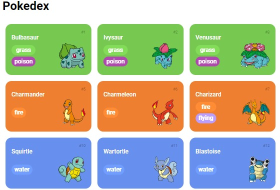

# Lab Project - Construindo uma Pokédex com JavaScript

Desenvolver uma plataforma web para listagem e visualização de pokémons. Todos os dados sobre os pokémons como nome, número, tipo, imagem e entre outras coisas, foram possíveis com o uso da API REST [PokéApi](https://pokeapi.co/).

  

Projeto desenvolvido durante o Santander Bootcamp 2023 - Fullstack Java+Angular, na DIO (Digital Innovation One).

## Funcionalidades

- [x] **Listagem dos pokémons**: Listar os pokémons com o uso da API REST.

- [x] **Load More**: Método para ampliar a quantia de pokémons mostrada ao usuário.

## Tecnologias Utilizadas

- **HTML**
- **CSS**
- **JavaScript**
- **API REST**
- **HTTP-Server**
